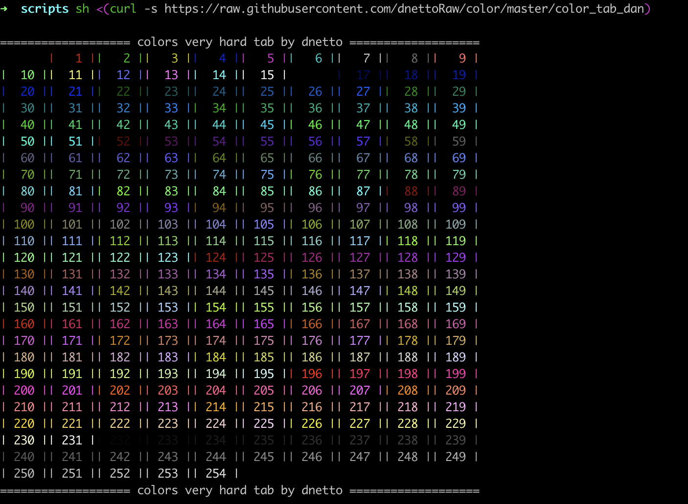

# color ascii 

```sh
sh <(curl -s https://raw.githubusercontent.com/dnettoRaw/color/master/color_tab_dan)
```


you can use it with `echo` and `printf`
```sh
echo "\033[38;5;227m in my amazing color \033[0m"
```
```sh
printf "\033[38;5;227m in my amazing color \033[0m"
```
to understand 

inside bracket is our color code `\033[38;5;[myCodeColor]m` 

to reset color `\033[0m`
